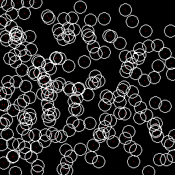

Cell Counter
================

This is fork from our original "NOAA Fisheries Steller Sea Lion Population Count" Kaggle Challenge Sea Lion Counter. We modified this Version which can now be used on Cell Datasets. The model is based on an [Inception-v4 network](https://arxiv.org/abs/1602.07261) (pre-trained on ImageNet; Szegedy et al., 2016) and [Count-ception](https://arxiv.org/abs/1703.08710) (Cohen et al., 2017). For more information see the original Sea Lion Counter repo.

#### Prerequisites:
- Python 3, numpy, tensorflow, see the requirements.txt

VGG Cell Dataset
=================

#### 1. Generate Coords
Download [VGG Cell Dataset](http://www.robots.ox.ac.uk/~vgg/research/counting/cells.zip), unzip and put cells folder into data folder.

Run `python vgg_generate_coords`

this file generates a coords.csv in an outdir folder, which will be used for subsequent processing and the network. The csv contains the coordinates for each cell annotated in the dot pictures.

To see if the coordinates are around the cells, you can run `python vgg_generate_coords circle tid` or `python vgg_generate_coords cellcircle tid` (whereas tid is an image id, e.g.: 10). This produces an image with circles, whereas the middle of the circle is from the coords.csv. Visually you should see that the circles are drawn around cells.
 

#### 2. Generate Tf.Records 

Run `python vgg_data_preparation` to generate the tf records files with a train/val split of of your choice.

Visually inspecting the sample can be done by changing `dry_run=False` to `True` and in folder debug the generated images are placed.

#### 3. Train the Network
Download [inception_v4.ckpt](https://github.com/tensorflow/models/tree/master/slim) and unpack the .tar.gz and put in data folder.

Run `main.py' and specify which dataset to use...

# TODO: 
- change so that vgg and all the other need just a cmd / so the paths in main.py , basic_model.py , etc. 
- Also tf records should be unique to dataset.
- Train with ADAM instead of cocob
- Check normalize inputs in basic_model

#### 4. Eval the Network

#### 5. Results

The network achieved an RMSE of around 8.4 on a validation set, but only around 19.5 on the test set. A main reason for that is possibly that the test set has on average a different scale than the training and validation sets and our model is unable to infer the scale from the input (e.g. from apparent sizes of features of the terrain) in order to achieve scale-invariance. This is particularily noticeable in the prediction of the classes `female` and `juvenile` which can mostly only be distinguished by size.

MB MICCAI2015 Dataset
=================
